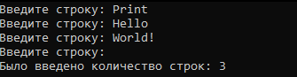

# Радостев Павел ИТС-2 Лабораторная №1

# Задание 1

## Задача 1

### Текст задачи

Сформировать список из чисел, на 1 меньших, чем вводимые значения.

### Алгоритм решения

1. Запросить ввод пользователя
2. Преобразовать ввод в массив чисел
3. Преобразовать массив чисел в список
4. Вывести список

### Тестирование

# Задание 2

## Задача 1

### Текст задачи

Сколько строк введено? (Признак конца ввода — пустая строка)

### Алгоритм решения

1. Запросить ввод строки
2. Если не введена пустая строка, увеличить счётчик на 1, иначе вывести количество строк (изначально 0)

### Тестирование

# Задание 3

## Задача 1

### Текст задачи

Создайте собственные функции для выполнения основных операций над списками (добавление/
удаление/поиск элемента, сцепка двух списков, получение элемента по номеру).

### Алгоритм решения

1. Создание функции добавления в начало списка
2. Создание функции удаления из списка с изменением порядка списка
3. Создание функции поиска элемента
4. Создание функции объединения списков
5. Создание функции получения элемента по индексу

### Тестирование

